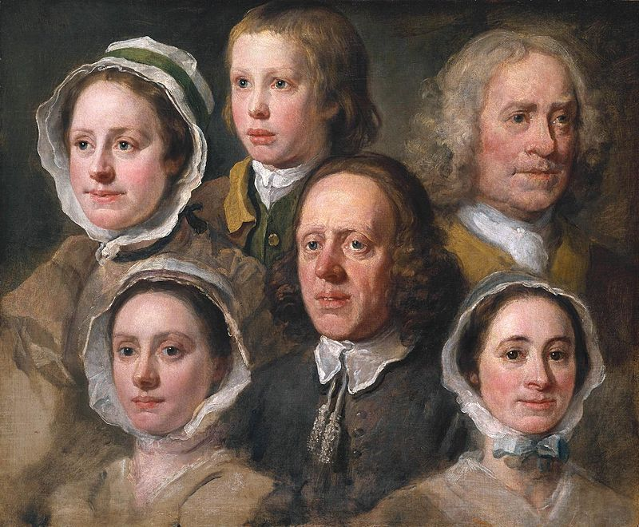
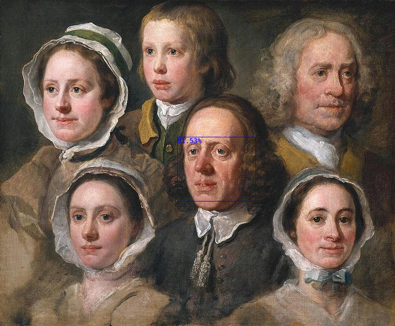

# MediaPipe Face Detection Example For WASI-NN with Tensorflow Lite Backend

This package is a high-level Rust bindings for [wasi-nn] example of BlazeFace(https://arxiv.org/abs/1907.05047) with Tensorflow Lite backend.

[wasi-nn]: https://github.com/WebAssembly/wasi-nn

## About the Model
MediaPipe Face Detection is an ultrafast face detection solution that comes with 6 landmarks and multi-face support. It is based on [BlazeFace](https://arxiv.org/abs/1907.05047), a lightweight and well-performing face detector tailored for mobile GPU inference.

The details of the tf-lite model used can be found in this [MediaPipe Model Card](https://drive.google.com/file/d/1d4-xJP9PVzOvMBDgIjz6NhvpnlG9_i0S/preview).

## Dependencies

This crate depends on the `wasi-nn` in the `Cargo.toml`:

```toml
[dependencies]
wasi-nn = "0.1.0"
image  = "0.23.14"
fastrand = "1.8.0" 
```

> Note: After the `TENSORFLOWLITE` encoding added into the wasi-nn crate, we'll update this example to use the newer version.

## Build

Compile the source code to WebAssembly:

```bash
cargo build --target=wasm32-wasi --release
```

The output WASM file will be at [`target/wasm32-wasi/release/wasmedge-wasinn-example-tflite-mediapipe-face-detection`](target/wasm32-wasi/release/wasmedge-wasinn-example-tflite-mediapipe-face-detection.wasm).
To speed up the image processing, we can enable the AOT mode in WasmEdge with:

```bash
wasmedgec target/wasm32-wasi/release/wasmedge-wasinn-example-tflite-mediapipe-face-detection.wasm out.wasm
```

## Run

### Required Files

The testing images are located at `./images`:

- ./images/test_image.jpg


- ./images/garrett-jackson-auTAb39ImXg-unsplash.jpg
- ./images/radu-florin-JyVcAIUAcPM-unsplash.jpg


The `tflite` model is located at `./face_detection_short_range.tflite`

### Output

Users should [install the WasmEdge with WASI-NN TensorFlow-Lite backend plug-in](https://wasmedge.org/book/en/write_wasm/rust/wasinn.html#get-wasmedge-with-wasi-nn-plug-in-tensorflow-lite-backend).

Execute the WASM with the `wasmedge` with Tensorflow Lite supporting:

```bash
wasmedge --dir .:. out.wasm face_detection_short_range.tflite /path/to/image_file.jpg/
```

This selects all the *DISTINCT FACES* in the image (filtered using confidence score threshold and `Non-Maximum Suppression` to avoid overlap) and gives the output

```bash
wasmedge --dir .:. out.wasm face_detection_short_range.tflite images/test_image.jpg 
```
```console
Read graph weights, size in bytes: 229032
Loaded graph into wasi-nn with ID: 0
Created wasi-nn execution context with ID: 0
Read input tensor, size in bytes: 196608
Executed graph inference

The number of distinct faces detected (AFTER NMS) are : 6 


The pixel co-ordinates for the bounding box of the detected faces with probability 0.92712575 are : 

(x1, y1) : 125 , 405
(x2, y2) : 281 , 534
The pixel co-ordinates of the facial keypoints are :
Left eye : 157 , 443 
Right eye : 215 , 443
Nose Tip : 172 , 474 
Mouth : 178 , 498 
Left eye tragion : 146 , 451 
Right eye tragion : 276 , 452 

The pixel co-ordinates for the bounding box of the detected faces with probability 0.9111204 are : 

(x1, y1) : 71 , 147
(x2, y2) : 228 , 277
The pixel co-ordinates of the facial keypoints are :
Left eye : 104 , 185 
Right eye : 165 , 191
Nose Tip : 121 , 223 
Mouth : 124 , 245 
Left eye tragion : 88 , 186 
Right eye tragion : 220 , 196 

The pixel co-ordinates for the bounding box of the detected faces with probability 0.90582424 are : 

(x1, y1) : 276 , 66
(x2, y2) : 448 , 209
The pixel co-ordinates of the facial keypoints are :
Left eye : 310 , 109 
Right eye : 366 , 113
Nose Tip : 314 , 149 
Mouth : 323 , 174 
Left eye tragion : 310 , 109 
Right eye tragion : 441 , 118 

The pixel co-ordinates for the bounding box of the detected faces with probability 0.89355844 are : 

(x1, y1) : 539 , 99
(x2, y2) : 737 , 263
The pixel co-ordinates of the facial keypoints are :
Left eye : 636 , 142 
Right eye : 705 , 151
Nose Tip : 692 , 186 
Mouth : 675 , 219 
Left eye tragion : 545 , 147 
Right eye tragion : 703 , 160 

The pixel co-ordinates for the bounding box of the detected faces with probability 0.8901366 are : 

(x1, y1) : 589 , 413
(x2, y2) : 726 , 527
The pixel co-ordinates of the facial keypoints are :
Left eye : 640 , 444 
Right eye : 696 , 450
Nose Tip : 673 , 473 
Mouth : 668 , 495 
Left eye tragion : 594 , 450 
Right eye tragion : 715 , 458 

The pixel co-ordinates for the bounding box of the detected faces with probability 0.86153024 are : 

(x1, y1) : 358 , 273
(x2, y2) : 521 , 408
The pixel co-ordinates of the facial keypoints are :
Left eye : 398 , 311 
Right eye : 460 , 314
Nose Tip : 417 , 344 
Mouth : 421 , 370 
Left eye tragion : 378 , 318 
Right eye tragion : 513 , 326 

 The output image is saved in the same place as "images/test_image.jpg"
```

To visualize these facial keypoints on the image, the output image can be found at `images/test_image.jpg_drawn_out.jpg` path.



### Similar results can be obtained by replacing `/path/to/image_file.jpg/` in both the commands with the other two images in the `./images` folder. 


#### This repository is created as a solution to pretest [LFX Mentorship 2023 01-Mar-May Challenge - for #2229 #2230](https://github.com/WasmEdge/WasmEdge/discussions/2230)